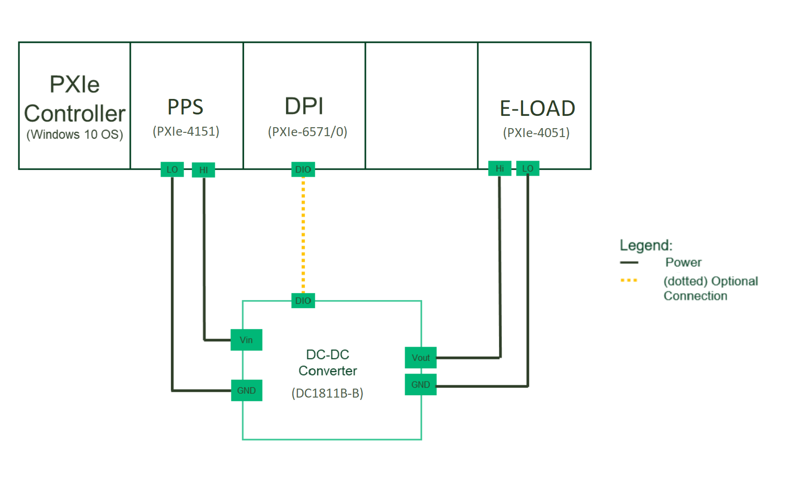

# PMIC - LabVIEW

"pmic-labview" is a MeasurementLink LabVIEW plugin for making measurements for Power Management IC's.
 This plugin supplies power to the DUT and sinks power from the DUT and validates the specifications of the DUT by performing measurements.

## Key Features

 - Single channel measurements
   - Efficiency and Load Regulation
   - Line Regulation
   - Load Transient Response
   - Ripple

 - Multi channel measurements

Click here for a detailed list of measurements and their functionality: [Measurement List](docs/measurements/meas-index.md)

## Hardware Setup

Instrumentation:
- NI Programmable Power Supply (NI 4151)
- NI Electronic Load (NI 4051)
- Digital Pattern Instrument (NI 6570/1) (note: the software does not include DPI or its dependencies, but it may be required to communicate with the DUT)

Tested hardware setup:
- NI 4151
- NI 4051
- NI 6570/1

## Software Dependencies

Install from NI Package Manager:

- InstrumentStudio (2024 Q1 or higher)
- Measurement Link (2024 Q1 or higher)
- NI-DCPower (2023 Q4 or higher)
- NI SDC Add-On (2023 Q4 or higher) (note: only if using DPI for DUT communication)

Download the latest NI package from the releases section of this repo or add the feed to NI Package Manager to get updates from this repo and other in this community.

## Getting Started
When you are ready to start using the software, check out [this](docs/help.md).

## Contributing
Use the instructions in [software development](docs/sw-dev.md) for setting up a development environment and overview of the code.
