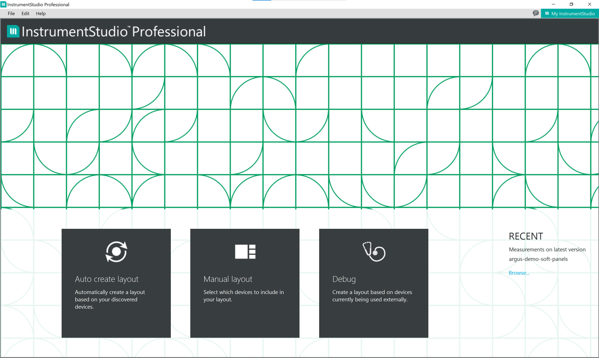
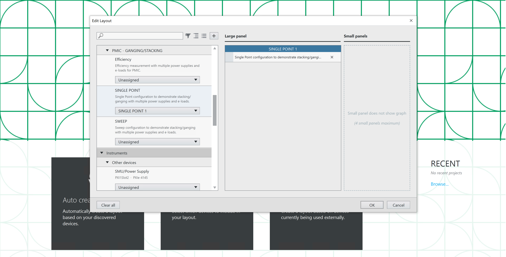
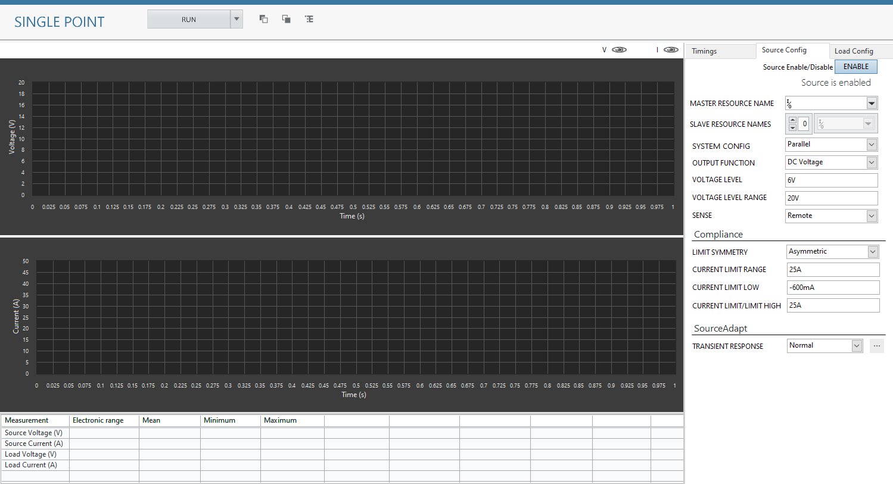
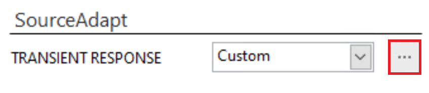
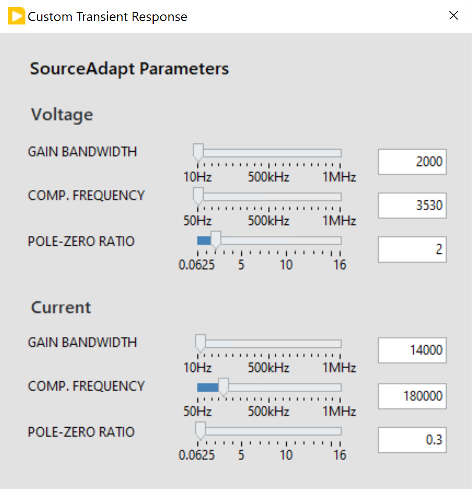
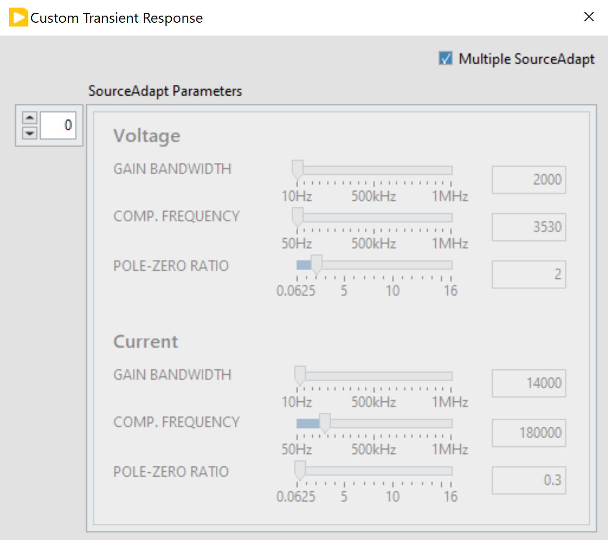
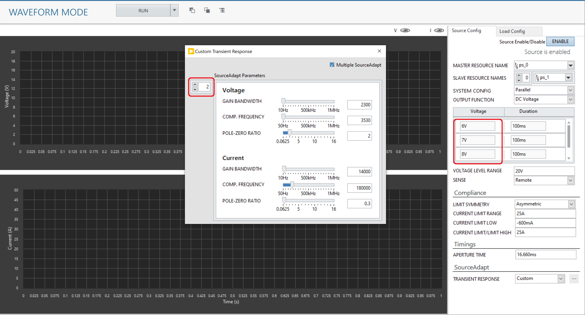
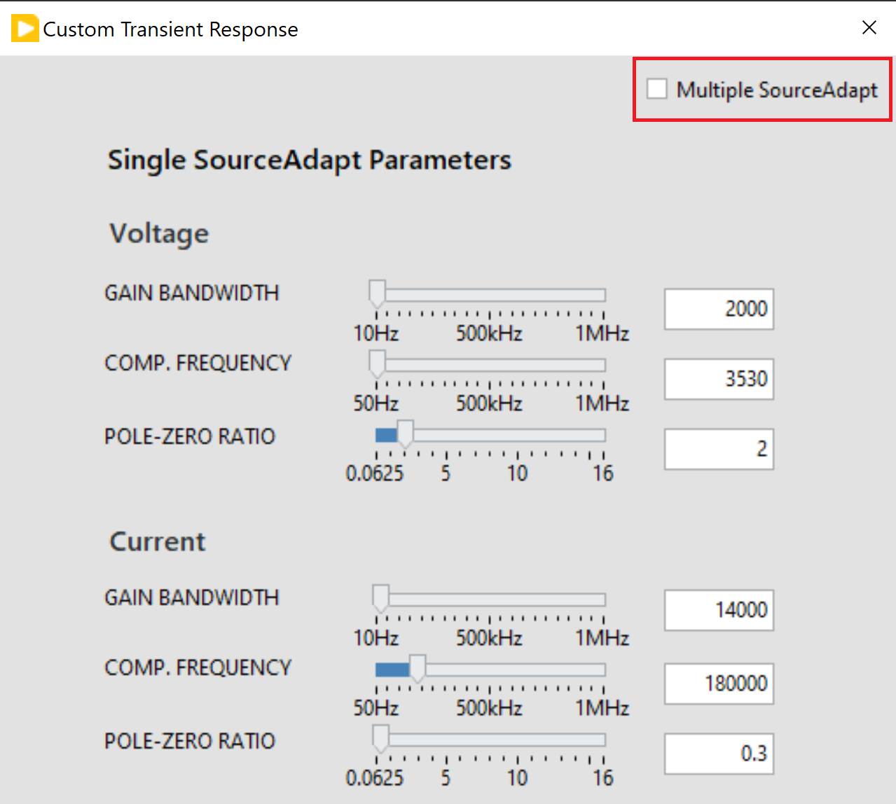

# Getting Started

## Workflow
This workflow is applicable for all the Channel Ganging measurements.

### Adding a measurement panel to InstrumentStudio

1. Open InstrumentStudio Pro
   

2. Click Manual Layout, and select required measurement under the collection (for e.g., 'Single Point' under PMIC - GANGING/STACKING) and 'Create Large Panel' from dropdown. Click OK.
   

3. Single Point channel ganging measurement UI will get displayed on a large panel as shown in the below screenshot.
   

### Custom Transient Response Configuration

1. In any Measurement panel, the default transient response for both source and load is 'Normal'. Custom transient response can be configured by changing the transient response to 'Custom' and the SourceAdapt parameters can be updated by clicking on the three dots icon beside the Transient Response control.

   

2. A dialog box will be launched with default SourceAdapt paramerters. 
   
   

3. For Waveform mode, Load Transient measurements; the launched dialog box will look like this.

   

   a. If different sourceAdapt parameters are needed for each step in the sequence, enable ‘Multiple SourceAdapt’, and provide the parameters in an array whose size is equal to sequence size.
      Ex: If there are three steps in the sequence, use three different sourceAdapt parameters i.e., the array size should be 3.

      

   b. If only one sourceAdapt parameters is needed for all the steps in the sequence, uncheck the ‘Multiple SourceAdapt’ box; and provide the parameters. 

      

4. Update the required parameters. Click on close and the parameters will be updated in the measurement.
   

Please refer [this](measurements/meas-index.md) for more details on each measurement.
