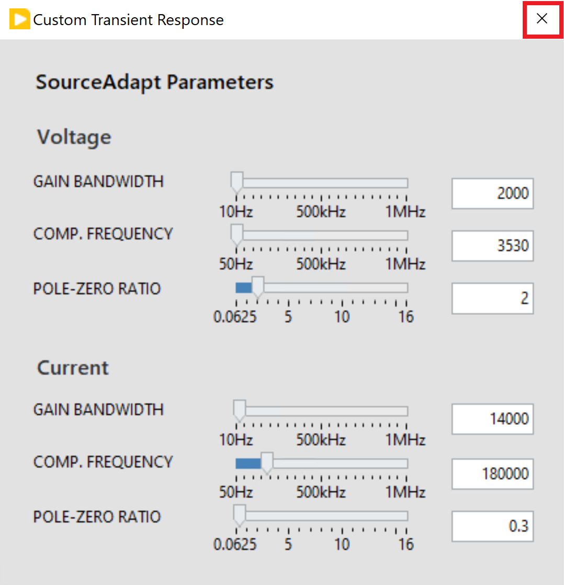

# Getting Started

## Workflow
This workflow is applicable for all the Channel Ganging measurements.

### Adding a measurement panel to InstrumentStudio

1. Open InstrumentStudio Pro
   

2. Click Manual Layout, and select required measurement under the collection (for e.g., 'Single Point' under PMIC - GANGING/STACKING) and 'Create Large Panel' from dropdown. Click OK.
   

3. Single Point channel ganging measurement UI will get displayed on a large panel as shown in the below screenshot.
   

### Custom Transient Response Configuration

1. In any Measurement panel, the default transient response for both source and load is 'Normal'. Custom transient response can be configured by changing the transient response to 'Custom' and the SourceAdapt parameters can be updated by clicking on the three dots icon beside the Transient Response control.

   

2. A dialog box will be launched with default SourceAdapt paramerters. 
   
   

3. Update the required parameters. Click on close and the parameters will be updated in the measurement.
   

Please refer [this](measurements/meas-index.md) for more details on each measurement.
