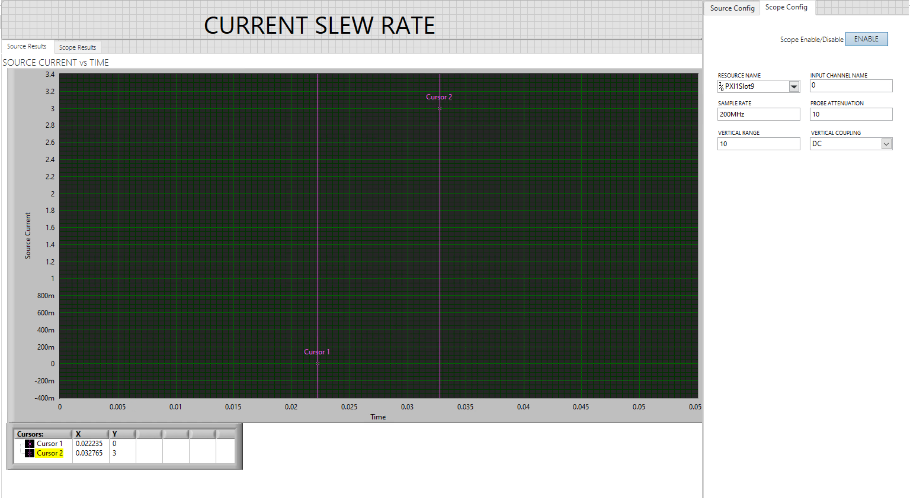

# Current Slew Rate
Cureesnt slew rate utility vi helps users to control current slew rate of power-supply PXIe-4151.

## Hardware Setup
 

## Utility VI
### Usage

1.Download the https://github.com/NI-Measurement-Plug-Ins/pmic-labview repo

2. Open source/utility/Current slew rate.vi
   
3. Select the appropriate source resouce name, current levels, update rate and other parameters. There is option of enabling or disabling of scope.
   

    
   
5. Run the vi. Source current graphs should be visible without any error, with help of two cursor validate if the time period of achevieing slew rate is similar to result indicator of EXPECTED TIME FOR SLEW RATE.

   Slew rate with Source capture:
  
   Slew rate with Scope capture:
  

### Notes:
## Defination:

1. Sample Rate:
   Specifies the rate at which that you can output data from the device and still achieve accurate 
results
   
2. Update Rate:
   Specifies the rate at which that you can input data to the device and achieve accurate 
results

3. Slew Rate:
   Specifies the rate at which a current increases to a set level
  
4. Expected Time for Slew Rate:
   Results the actual time require for power supply to acheive desiered slew rate.
   
5. Transient Response:
   Specifies the transient response of power supply.

6. Current Gain Bandwidth:
   Specifies the SourceAdapt gain-bandwidth parameter for the current control loop. 
   Higher GBW values allow for faster transients but less stability, while lower GBW values result in slower transients but more stability.

7. Current Compensation Frequency:
   Specifies the SourceAdapt compensation frequency parameter for the current control loop. It is the frequency at which a pole-zero pair is added to the system.

8. Current Pole-Zero Ratio:
    Specifies the SourceAdapt pole-zero ratio parameter for the current control loop. It is the ratio of pole and zero frequencies.

