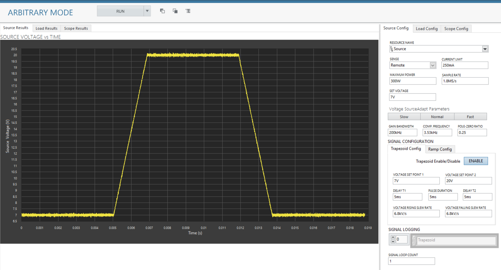
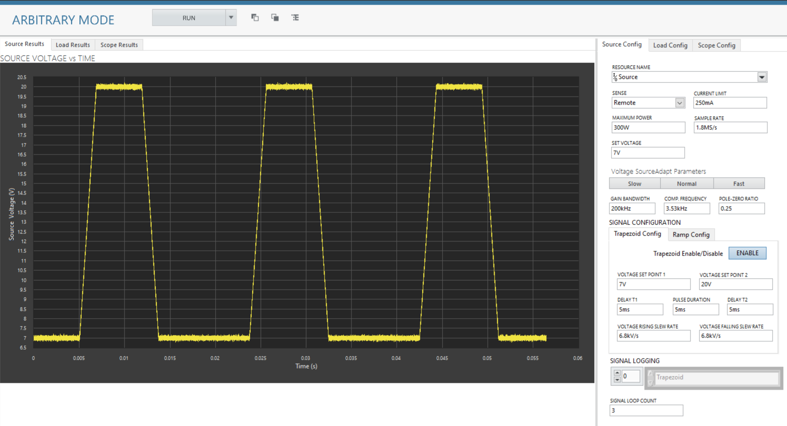
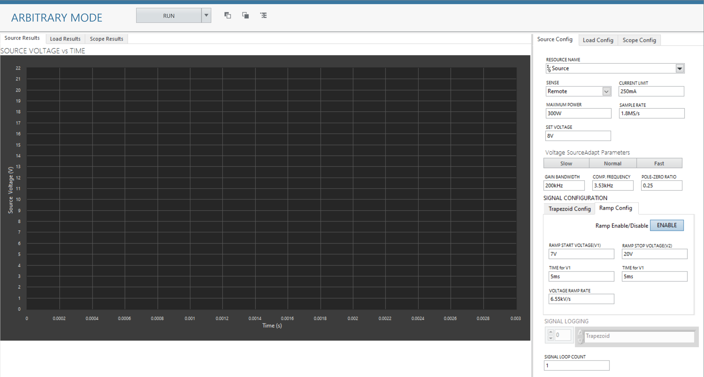
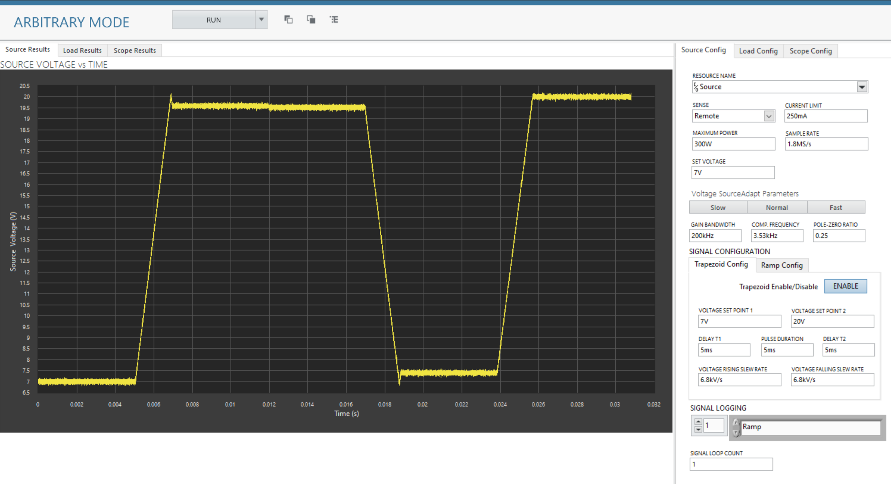

# Arbitrary Mode
This service generates Arbitrary waveform for source voltage.

## Hardware Setup
   

## InstrumentStudio Panel

### Usage 1 : Only single type of source voltage pattern generated

Here in given result single trapezoidal signal is generated where user can select the width, start and stop delay, start and pulse voltage and their respective rate of increament and decreament.

1. Select the appropriate source and load resource names or scope name (If connected to scope or want to analyse load) and update other parameters as needed. 

   

2. Run the measurement. The source voltage pattern in the graphs.

   

### Usage 2 : Only single type of source voltage pattern generated in loop which is controlled by loop count parameter

Here in given result single trapezoidal signal is generated in loop with same settings for 3 times also user has control over width, start and stop delay, start and pulse voltage and their respective rate of increament and decreament.

1. Select the appropriate source and load resource names or scope name (If connected to scope or want to analyse load) and update other parameters as needed. 

   

2. Run the measurement. The source voltage pattern in the graphs.

   

### Usage 3 : Two different single type of source voltage pattern generated in loop which is controlled by loop count parameter and signal logging.

Here in given result single trapezoidal and ramp signal is generated, also user has control over width, start and stop delay, start and pulse voltage and their respective rate of increament and decreament.

Steps to achevie the signal logging:
Step 1: Enable both ramp and trapezoid the signal to log
step 2: In signal logging array control select either ramp or trapezoid, user cna select multiple pattern in the array.

1. Select the appropriate source and load resource names or scope name (If connected to scope or want to analyse load) and update other parameters as needed. 

   

2. Run the measurement. The source voltage pattern in the graphs.

   

   
