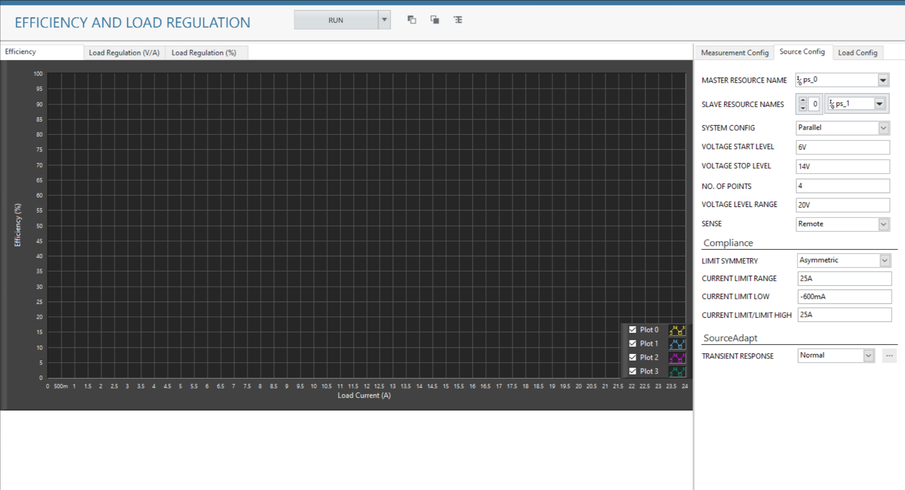
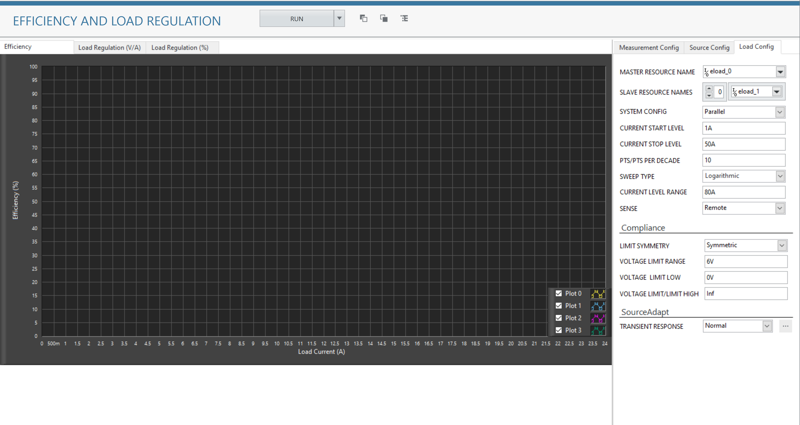
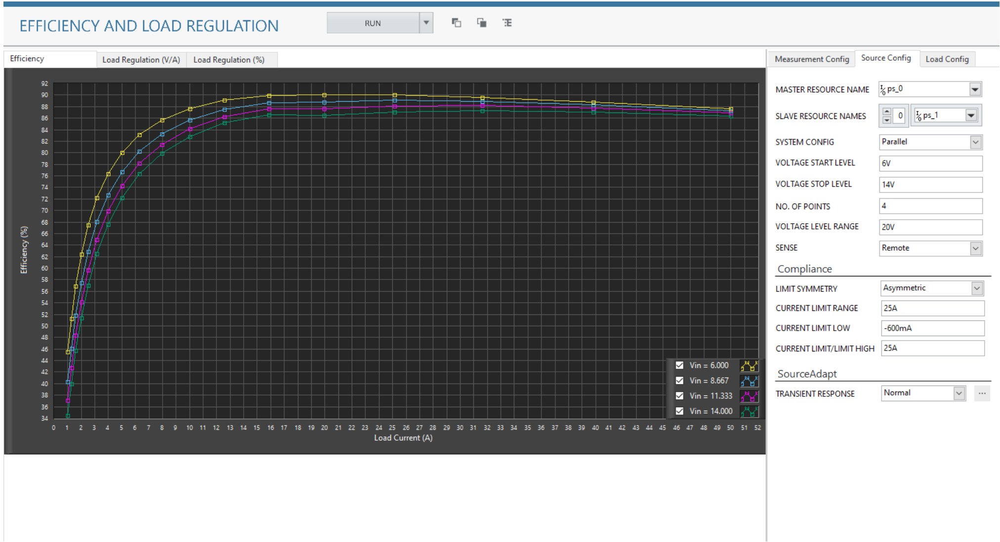
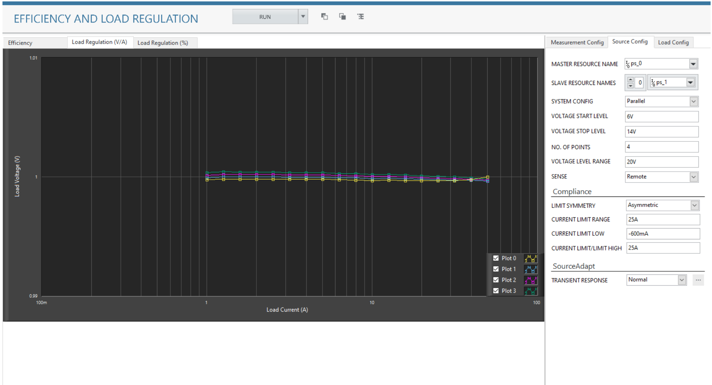
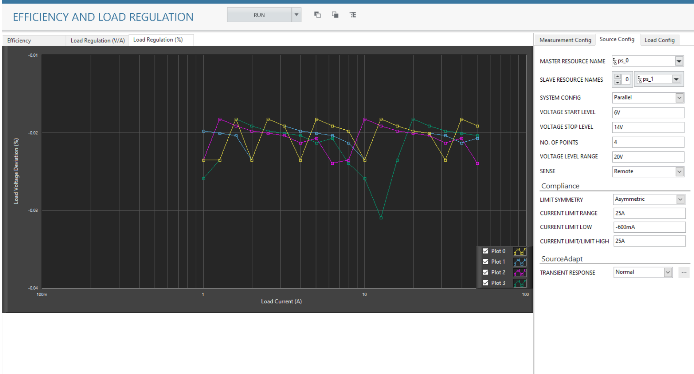

# Efficiency and Load Regulation Channel Ganging
This service performs Efficiency and Load Regulation measurement with Ganging/Stacking.

## Hardware Setup
  

## InstrumentStudio Panel

### Usage

1. Select the appropriate source resource names of all the instruments which are stacked or ganged. One of the instruments will be master and others will be slave devices. Update the other parameters as per the system configuration.
   

2. Similarly, update the parameters in the load configuration.
   

3. Run the measurement. The efficiency values are plotted in the graph.
   
   Efficiency:
   
   Load Regulation(V/V):
   
   Load Regulation(%):
   

## Tested with
- 2xPXIe-4151
- 2xPXIe-4051

(Note: Tested with 2 power supplies and 2 E-load's connected in parallel configuration as per the hardware setup diagram.)

