# Efficiency and Load Regulation Measurement
Efficiency and Load Regulation measurement evaluate how well a power device delivers output power and maintains a stable output voltage as the load varies. By applying an input source and adjusting the load current, the measurement calculates overall efficiency and observes voltage changes, helping verify power supply performance across different operating conditions. 

## Hardware Setup
Make the setup and verify that the PXIe Chassis and Modules are powered and connected.  
1) Single Source-Single Load
  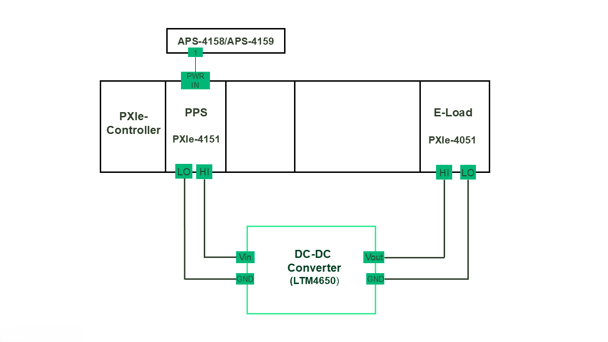

2) Single Source-Ganged Load
  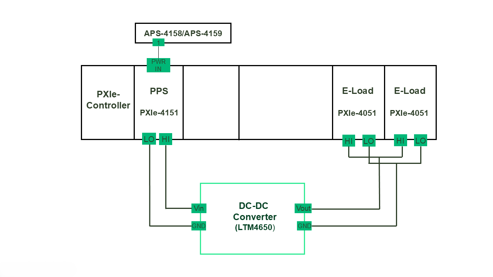

3) Ganged Source-Single Load
   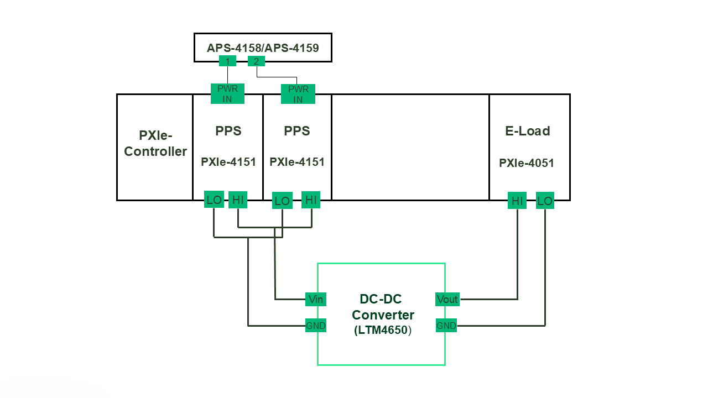

4) Ganged Source-Ganged Load
   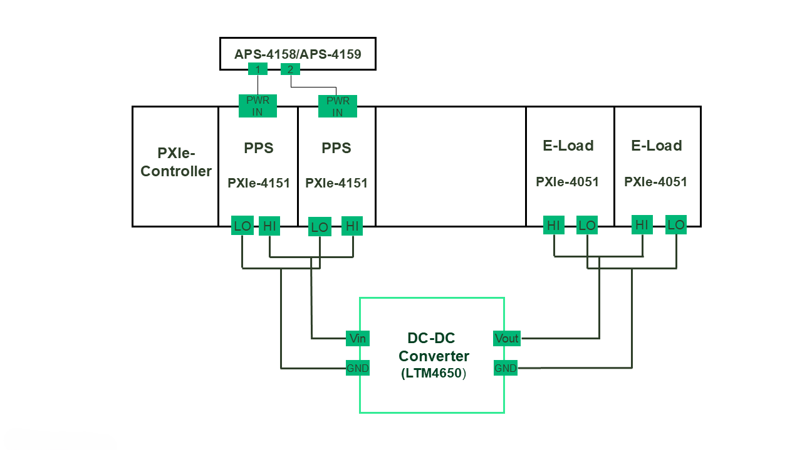  

## InstrumentStudio Panel

Launch InstrumentStudio (2024 Q3 or higher) and open "Efficiency and Load Regulation Measurement".

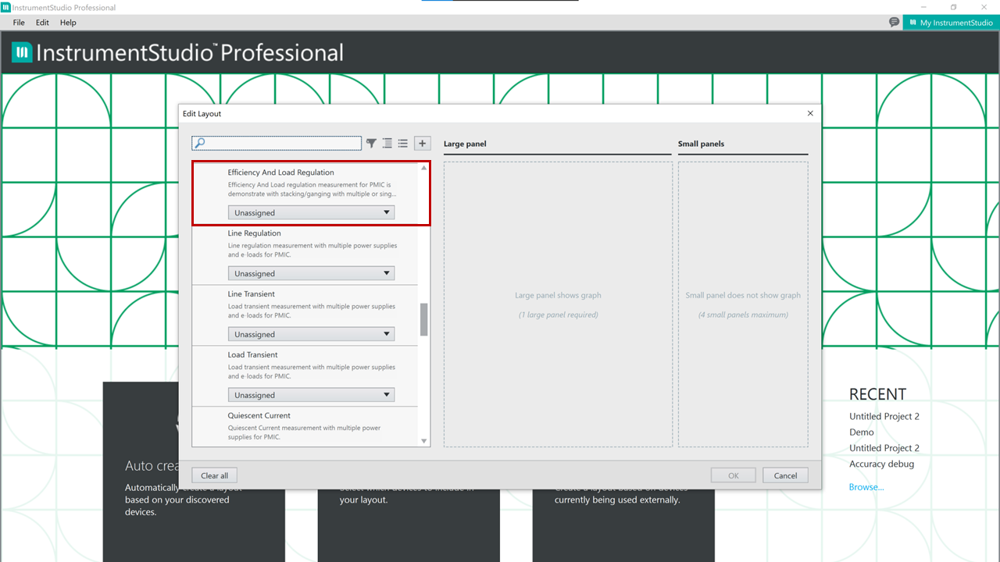

### Usage

1) The measurement has different modes of operation - Power ON/Power OFF and Perform Measurement. 

2) #### Power ON:
   In this mode of operation, a Voltage within the allowable operating range of the DUT is set in Voltage level, to Initialize. The DUT can be powered using either a single source or multiple ganged sources, depending on the selected configuration, as defined below:
   
   a) Configuration 1: Single Source
   
   

   b) Configuration 2: Ganged Source
   

4) #### Perform Measurement:
  This mode evaluates system behaviour across different configurations.
  
  3.1) Select the appropriate Source and Load resource names and update other parameters as needed.
  
  3.2) Run the measurement for following configurations.

   a) Configuration 1: Single Source, Single Load

   i) Efficiency
   

   ii) Load Regulation (V/A)
   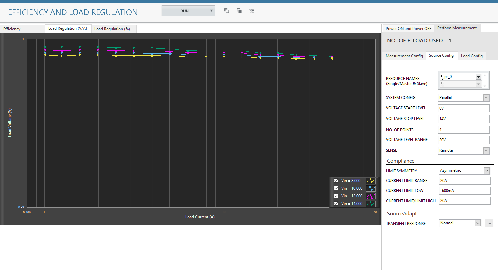

   iii) Load Regulation (%)
   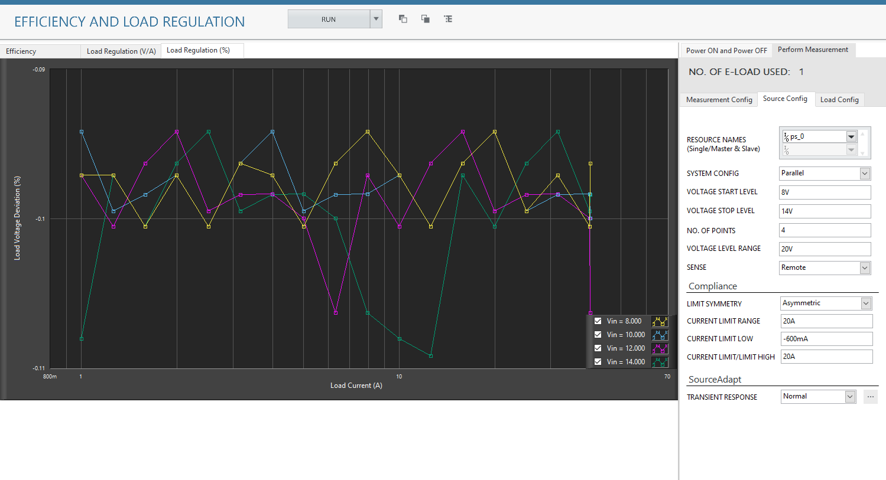

   b) Configuration 2: Single Source, Ganged Load

   i) Efficiency
   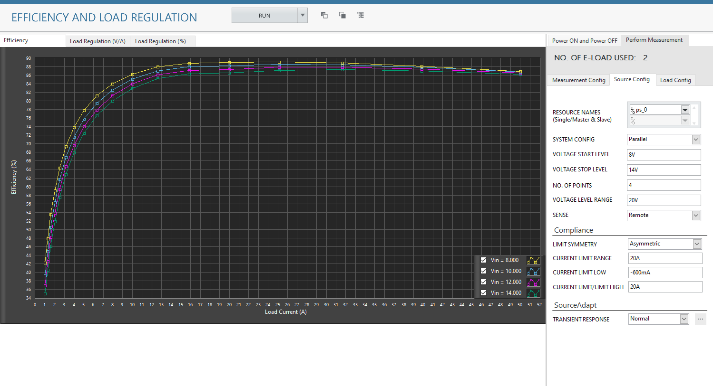

   ii) Load Regulation (V/A)
   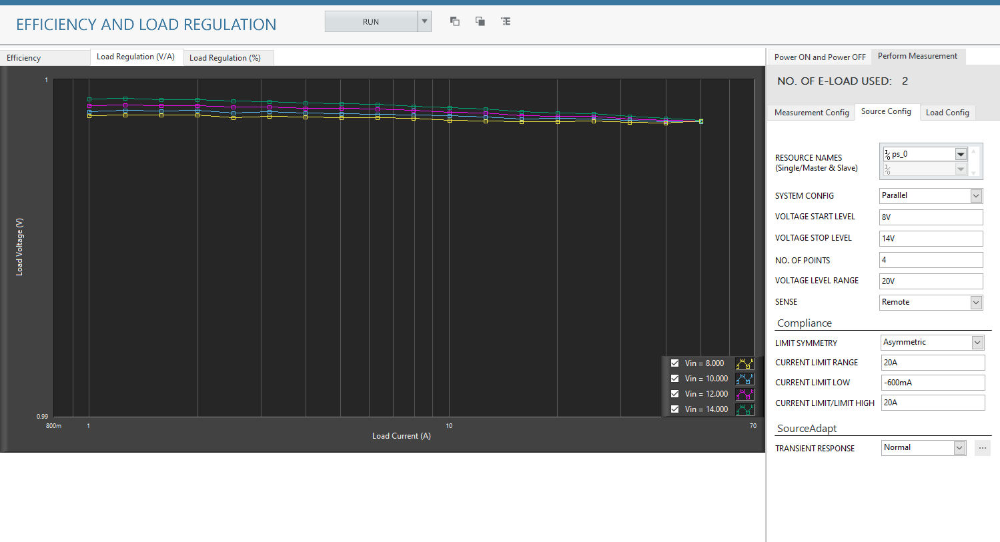

   iii) Load Regulation (%)
   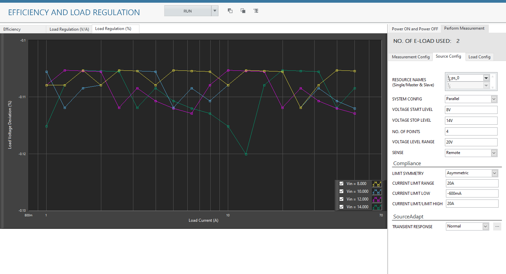

   c) Configuration 3: Ganged Source, Single Load

   i) Efficiency
   

   ii) Load Regulation (V/A)
   

   iii) Load Regulation (%)
   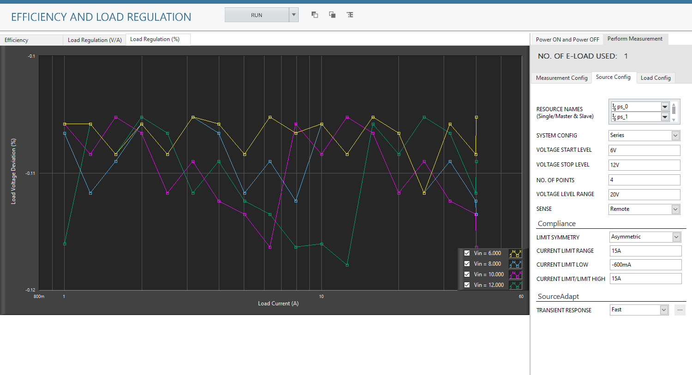

   d) Configuration 4: Ganged Source, Ganged Load

   i) Efficiency
   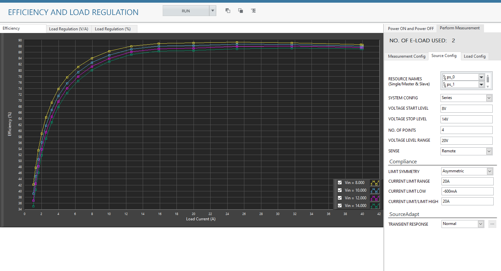

   ii) Load Regulation (V/A)
   

   iii) Load Regulation (%)
   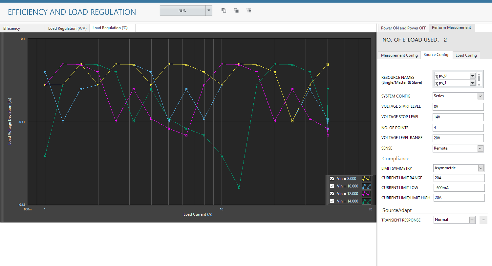

4) #### Power OFF:
   This mode disables the voltage supplied to the DUT for each supporting specific configurations -

   a) Configuration 1: Single Source, Single Load
   

   b) Configuration 2: Single Source, Ganged Load
   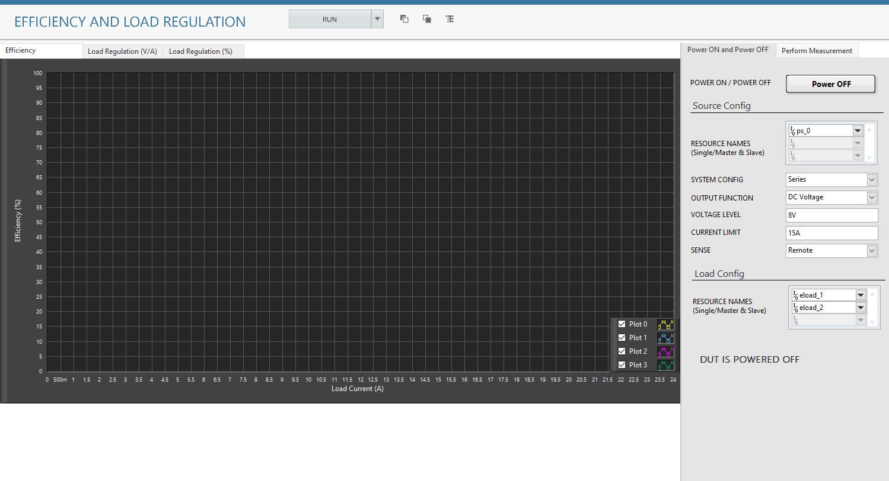

   c) Configuration 3: Ganged Source, Single Load
   

   d) Configuration 4: Ganged Source, Ganged Load
   

     
## Tested with
- 2xPXIe-4151
- 2xPXIe-4051

