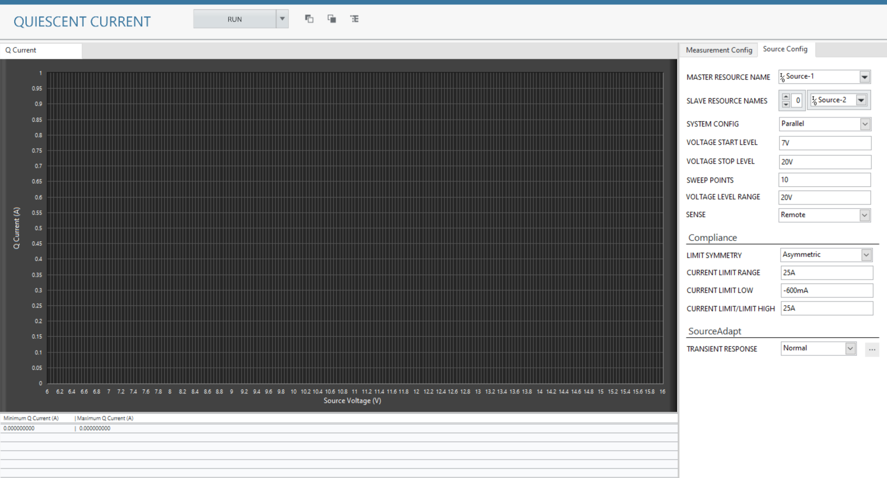

# Q-current Channel Ganging
This service performs Q-current Ganging/Stacking.

## Hardware Setup
  

## InstrumentStudio Panel

### Usage

1. Select appropriate source resource names of all the instruments which are stacked or ganged. One of the instruments will be master device and others will be slave devices. Update other parameters as per the system configuration.
    and 

2. Run the measurement. The system level and individual voltages and currents are plotted in the graphs.
   
   

## Tested with
- 2xPXIe-4151

(Note: Tested with 2 power supplies connected in parallel configuration as per the hardware setup diagram.)
