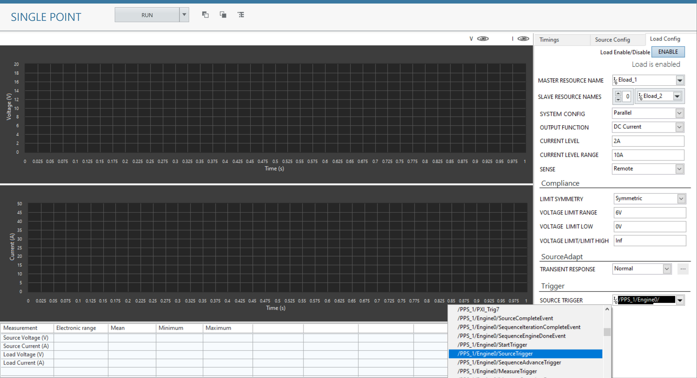

# Single Point Channel Ganging
This service performs Single Point Ganging/Stacking.

## Hardware Setup
  

## InstrumentStudio Panel

### Usage

1. Select the appropriate source resource names of all the instruments which are stacked or ganged along with their channels and channel modes. (Note: Only one of the instruments will be in master mode and others will be in slave mode). Update the other parameters as per the system configuration.
   

2. Similarly, update the parameters in the load configuration. For both the PPS and E-Load devices to be in sync, provide source trigger of master PPS as a trigger to master E-Load.
   

3. Run the measurement. The system level and individual voltages and currents are plotted in the graphs.
   
   System Measurements:
   

   Source Results:
   

   Load Results:
   

## Tested with
- 2xPXIe-4151
- 2xPXIe-4051

(Note: Tested with 2 power supplies and 2 E-load's connected in different chassis in parallel configuration as per the hardware setup diagram.)

