# Sweep Measurement
Sweep Measurement provides a controlled way to vary a Source and Load parameters (typically voltage or current) across a defined range while monitoring the DUT’s response. By configuring start/stop values, step size, and choosing between linear or logarithmic scaling, a detailed V-I characteristics will be generated, and DUT’s behaviour is observed across its operating region.

## Hardware Setup
Make the setup for different configurations and verify that the PXIe Chassis and Modules are powered and connected.

1. Single Source-Single Load

  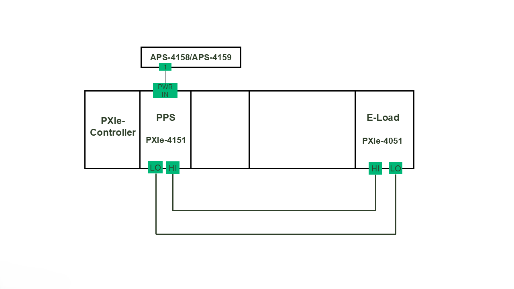 

2. Single Source-Ganged Load
  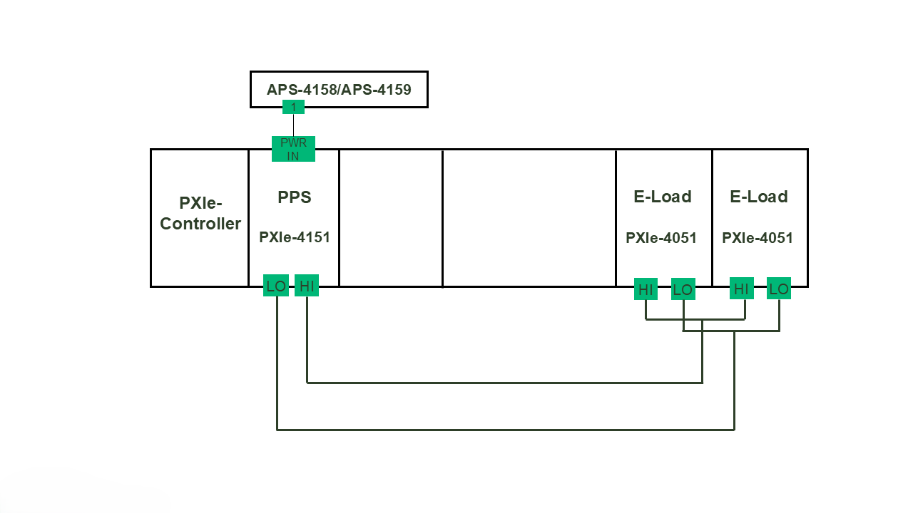

3. Ganged Source-Single Load
   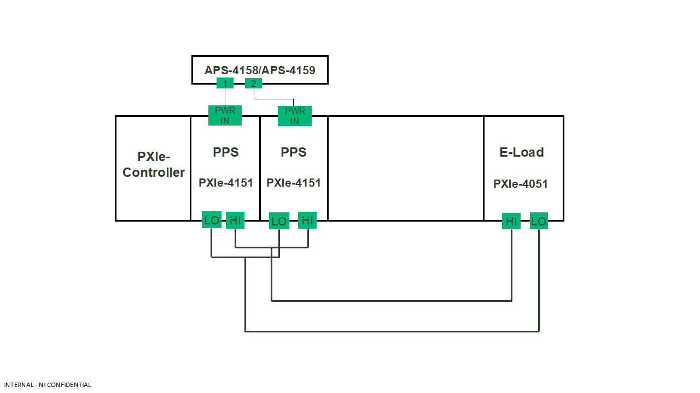

4. Ganged Source-Ganged Load
   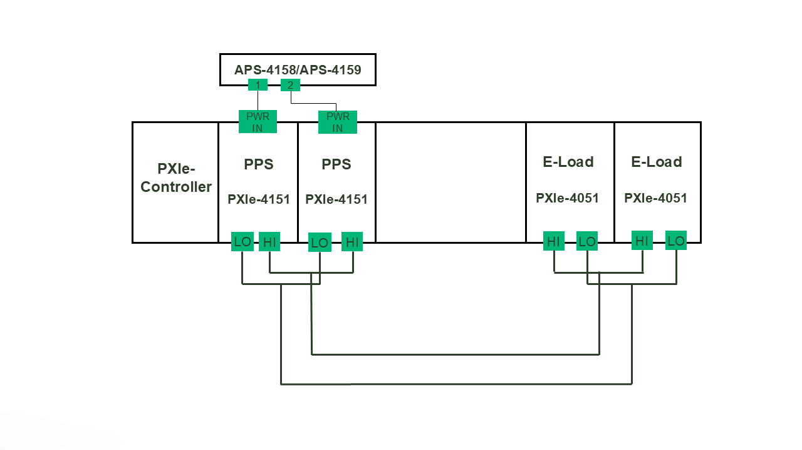
                                                                                   
## InstrumentStudio Panel
Launch InstrumentStudio (2024 Q3 or higher) and open "Sweep Measurement".

### Usage

1. The measurement has different modes of operation - Power ON/Power OFF and Perform Measurement. 

2. #### Power ON:
   In this mode of operation, a Voltage within the allowable operating range of the DUT is set in Voltage level, to Initialize. The DUT can be powered using either a single source or multiple ganged sources, depending on the selected configuration, as defined below:
   
   a) Configuration 1: Single Source
   
   
   
   b) Configuration 2: Ganged Source

   
   
3. #### Perform Measurement:
   This mode evaluates system behaviour under three operating states:

   i. Both Source and Load enabled
   
   ii. Source only enabled

   iii. Load only enabled
   
   Each state is further assessed across different configurations as below:

3.1) When both Source configuration and Load configuration are Enabled.
     
   i. Select the appropriate Source and Load resource names and update other parameters as needed. (Note: Both source and load configuration are “Enabled” by default.

   ii. Run the measurement for all four following configurations. Based on the parameters defined, the source and load I-V sweeps are plotted in the graphs. 

   a) Configuration 1: Single Source, Single Load 

   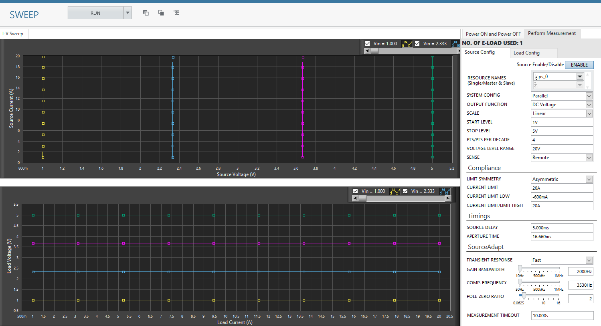

   b) Configuration 2: Single Source, Ganged Load

   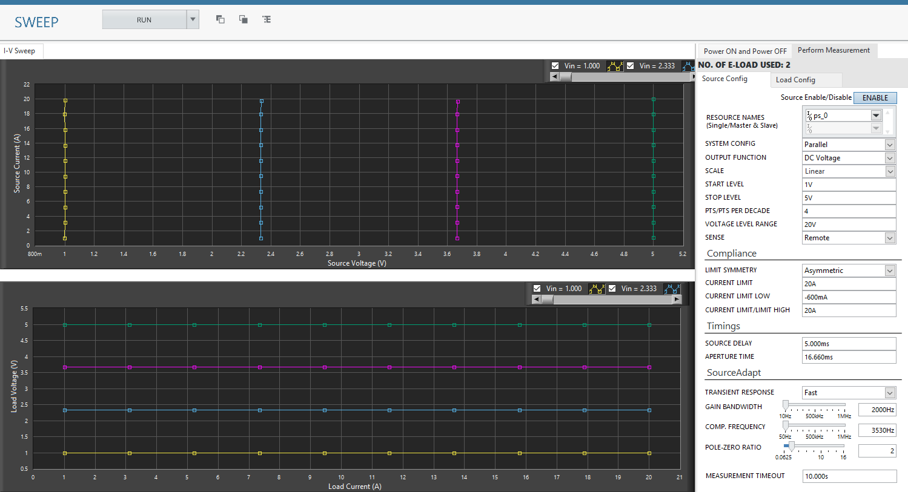

   c) Configuration 3: Ganged Source, Single Load 

   

   d) Configuration 4: Ganged Source, Ganged Load

   

3.2) When Source configuration is Enabled and Load configuration is Disabled.

   i. To run only sweep of source devices, make sure that the Enable button is 'ON' in the source configuration and is in 'OFF' position in the load configuration. 

   ii. Run the measurement for following configurations. Based on the parameters defined, the Source I-V sweeps are plotted in the graphs. 

   a) Configuration 1: Single Source

   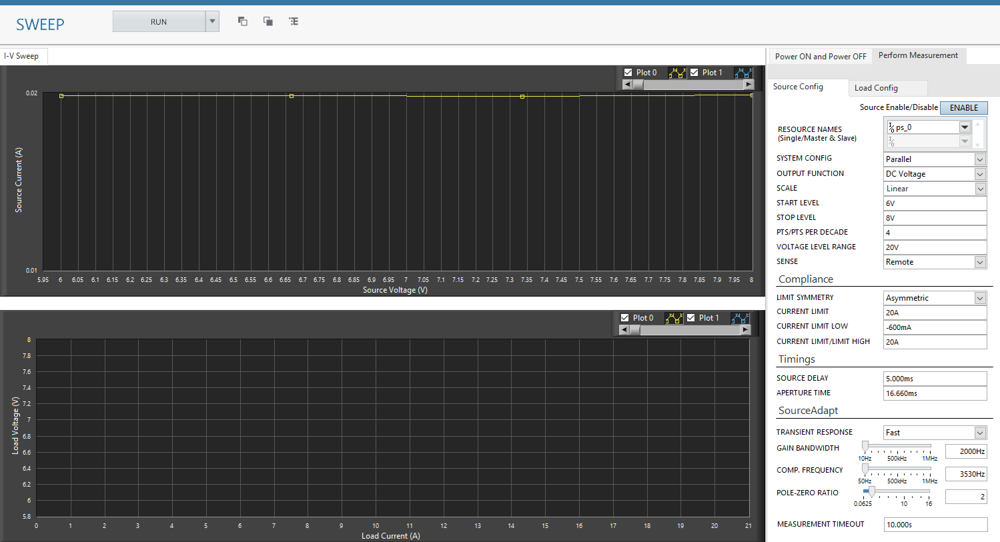

   b) Configuration 2: Ganged Source

   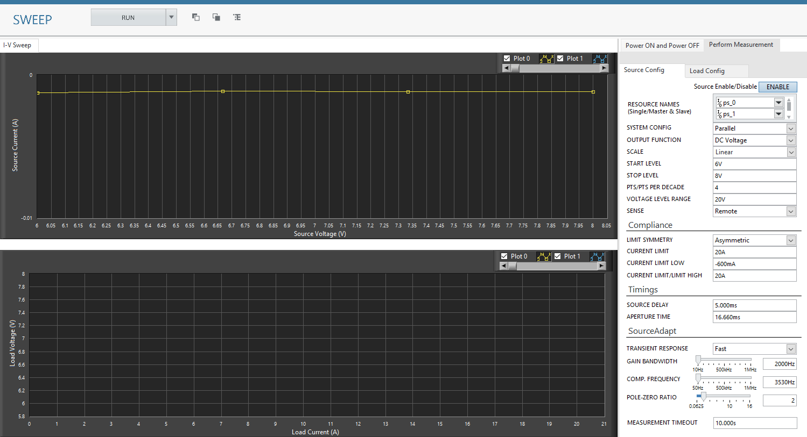

 3.3) When Source configuration is Disabled and Load configuration is Enabled.   

   i. To run only sweep of Load devices, make sure that the Enable button is 'OFF' in the source configuration and is in 'ON' position in the load configuration. 

   ii. Run the measurement for following configurations. Based on the parameters defined, the Load I-V sweeps are plotted in the graph.  

   a) Configuration 1: Single Load 

   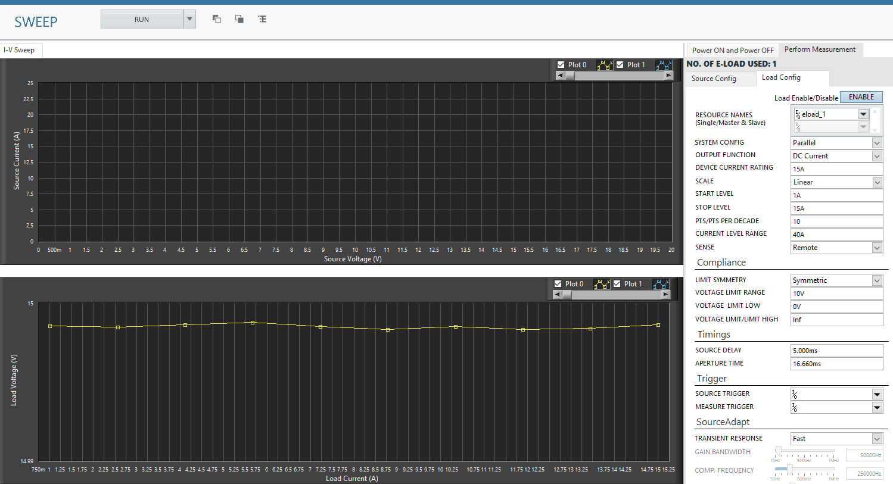

   b) Configuration 2: Ganged Load

   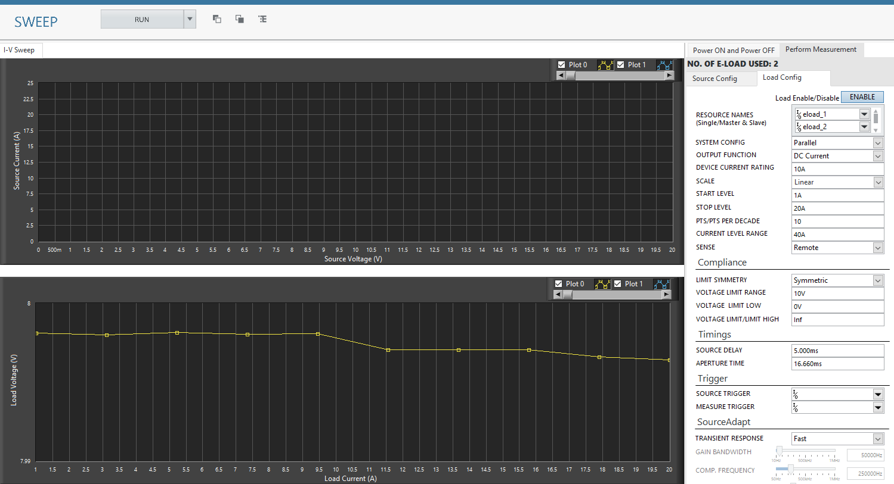

4. #### Power OFF

This mode disables the voltage supplied to the DUT under three operating states, each supporting specific configurations:

4.1) When both Source configuration and Load configuration are Enabled. 

   a) Configuration 1: Single Source, Single Load

   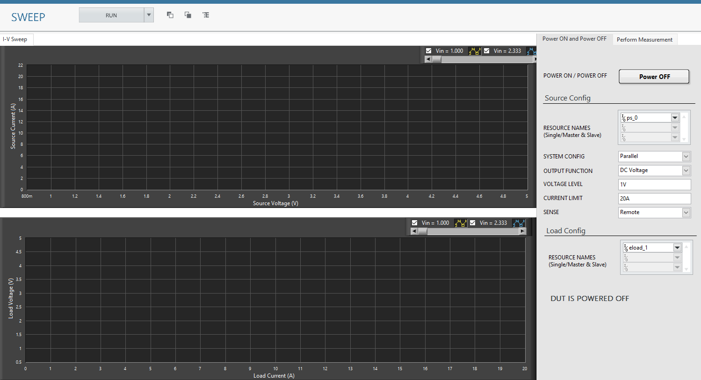

   b) Configuration 2: Single Source, Ganged Load

   

   c) Configuration 3: Ganged Source, Single Load

   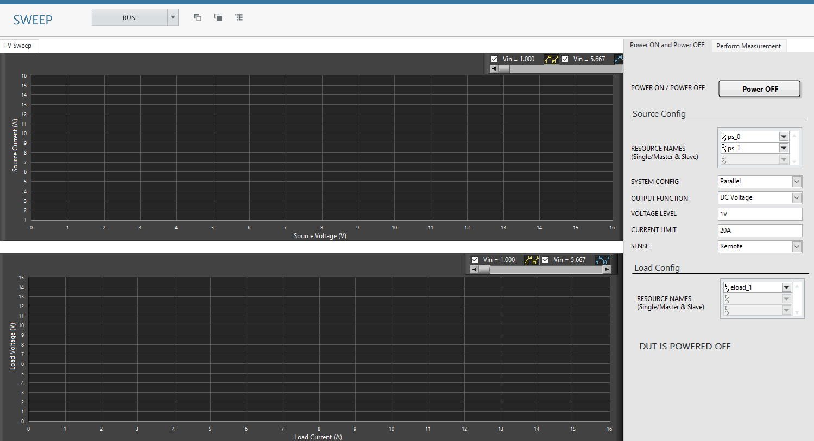

   d) Configuration 4: Ganged Source, Ganged Load

   

4.2) When Source configuration is Enabled and Load configuration is Disabled.  

   a) Configuration 1: Single Source 

   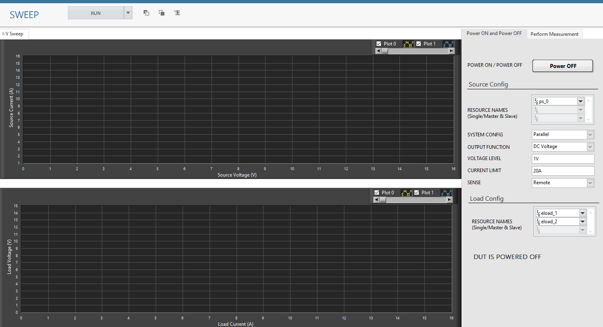

   b) Configuration 1: Ganged Source

   

4.3) When source configuration is disabled and load configuration is enabled. 

   a) Configuration 1: Single Load

   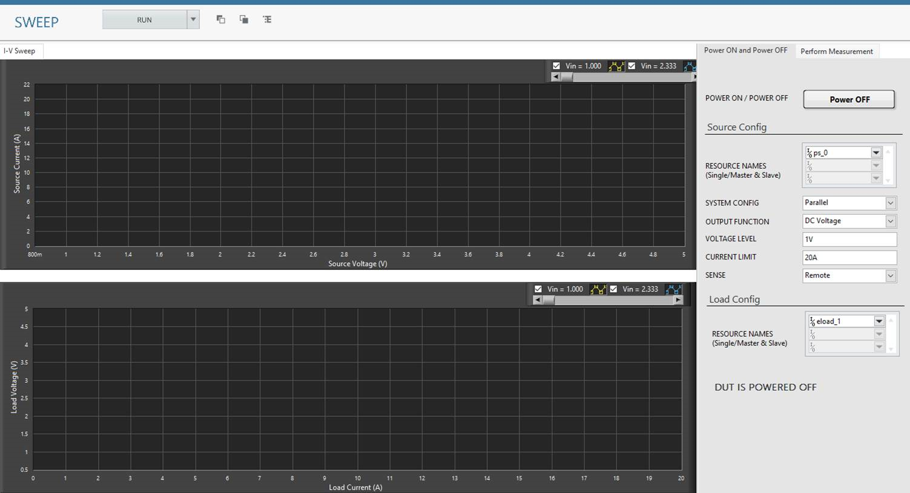

   b) Configuration 2: Ganged Load

   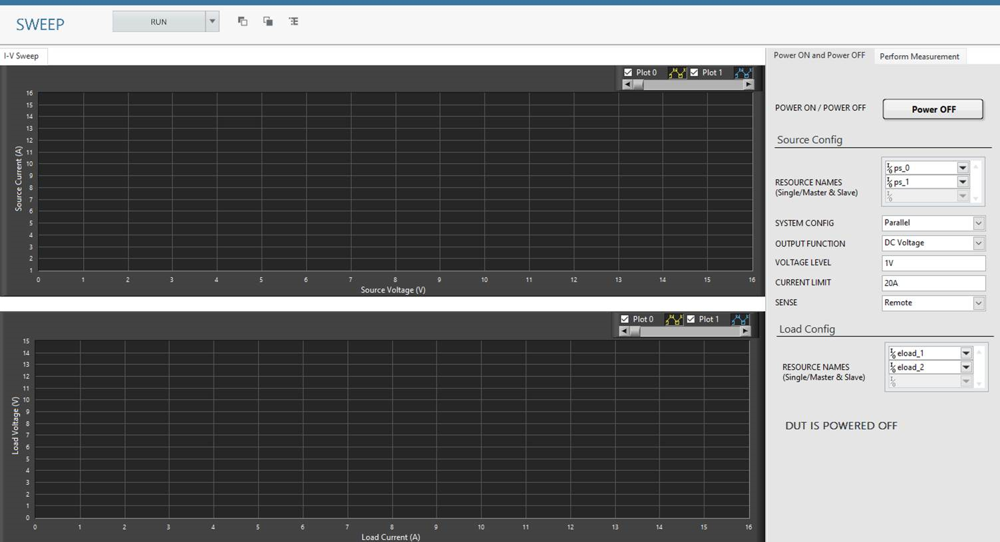

## Tested with
- 2xPXIe-4151
- 2xPXIe-4051

(Note: Tested with 2 power supplies and 2 E-load's connected in parallel configuration as per the hardware setup diagram.)

