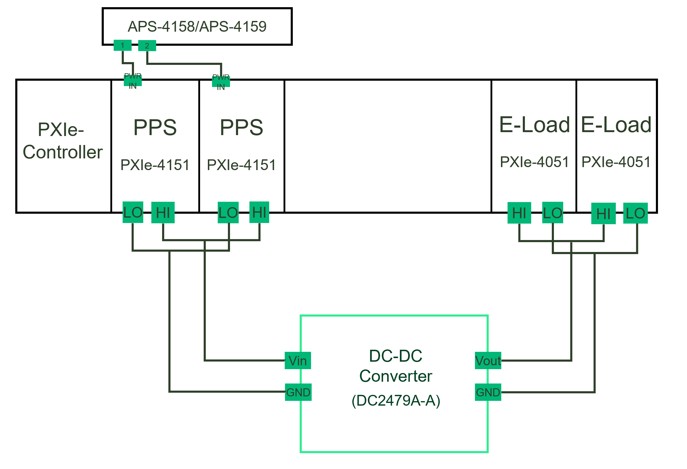
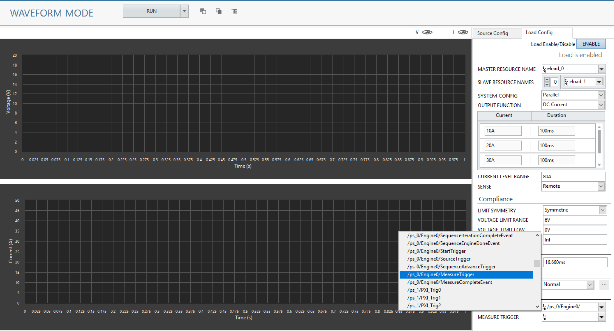
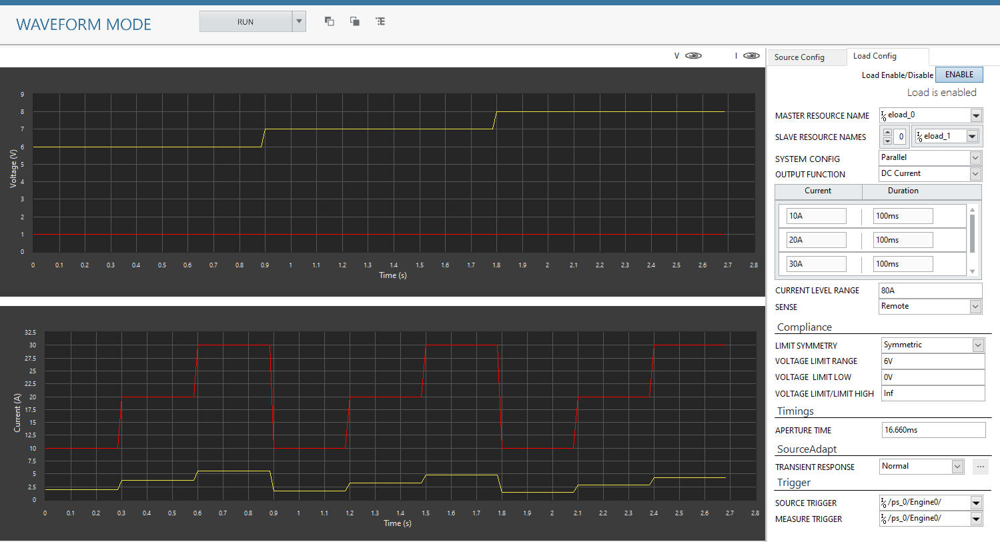
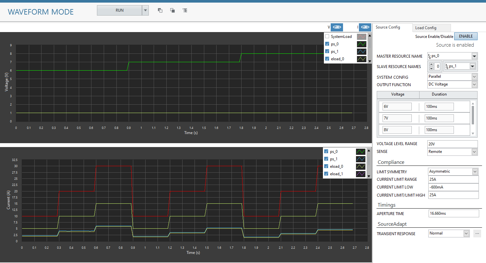
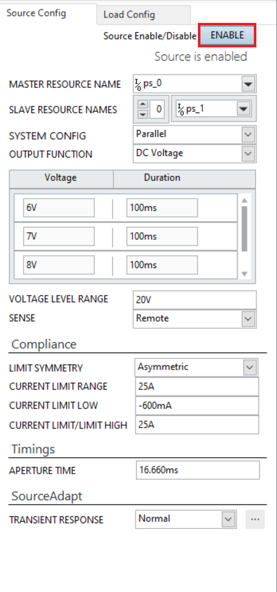
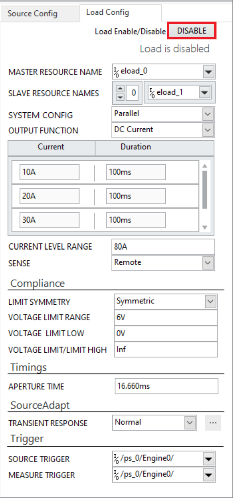
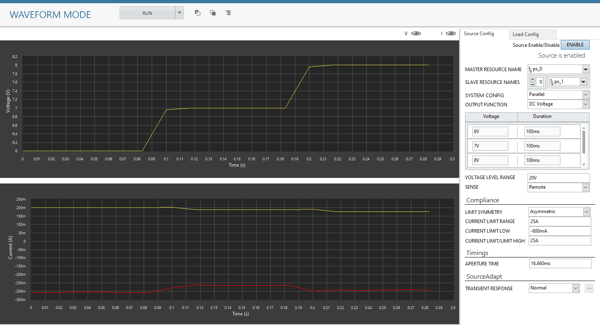
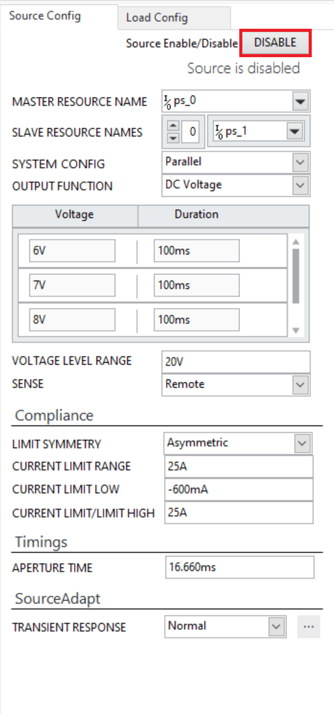
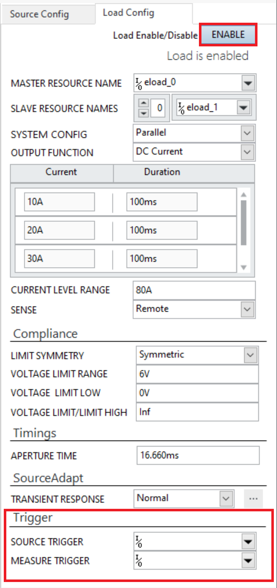

# Waveform Mode Channel Ganging
This service performs Waveform Mode Ganging/Stacking.

## Hardware Setup
  

## InstrumentStudio Panel

### Usage

1. Select the appropriate source resource names of all the instruments which are stacked or ganged. One of the instruments will be master device and others will be slave devices. Update other parameters as per the system configuration.
   

2. Similarly, update the parameters in the load configuration. For both the PPS and E-Load devices to be in sync, provide source trigger and measure trigger of master PPS to master E-Load respectively.
   

3. Run the measurement. The system level and individual voltages and currents are plotted in the graphs.
   
   

4. To view the individual voltages and currents, click on the eye button and check the plots checkbox.

    

5. We can run the source and load independently as well. To run only configuration of source devices, make sure that the Enable button is 'ON' in the source configuration and is in 'OFF' position in the load configuration.
   

   

6. Run the measurement. The source results can be seen in the graph. 
 
   

7. Similarly load devices can be run independently without a DUT, Enable button should be 'ON' in load config and it should be 'OFF' in source config. The trigger controls can be left empty.
   

   

8. For configuring custom transient response, refer to [this](../../channel-ganging-help.md) document.

## Tested with
- 2xPXIe-4151
- 2xPXIe-4051

(Note: Tested with 2 power supplies and 2 E-load's connected in parallel configuration as per the hardware setup diagram.)

