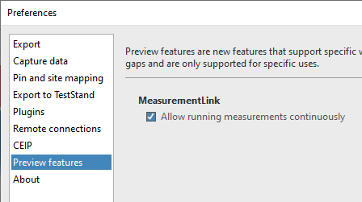
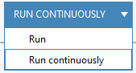

# Continuous Run in InstrumentStudio

## How to Enable
In InstrumentStudio, go to File>>Preferences. Under the **Preview features** section, enable the option called *Allow running measurements continuously*.  

## How to Use
Next time that you launch InstrumentStudio, the **Run** button will have a drop down next to it where to can select the mode.  
  
In continuous run mode, InstrumentStudio will execute the measurement service and when it is complete, it will immediately run it again until the **Stop** button is pressed. If any controls tied to the measurement service are updated, the execution will be aborted and run again with the new values.

