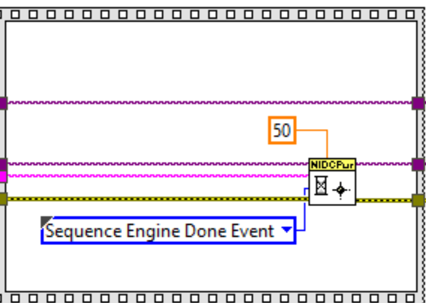
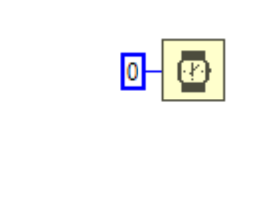

# Parameters used in the measurements

## Measurement settings

1. DUT Setup Time:
   Specifies the setup time of a DUT, the time required to load the DUT parameters and for the DUT startup.

2. Source Delay:
   Specifies the time required for the source and load instruments to reach steady state after a setpoint change. This parameter can be minimized to reduce test time, but if it is too small the DUT will not have enough time to reach the steady state.

3. Aperture Time:
   Specifies the amount of time the source and load instruments collect samples and average the samples together to form a single measurement. Longer aperture time increases the test time but improves the noise rejection.

4. Nominal Output Voltage:
   Enter the expected nominal output voltage of the DUT. This value is used only for the calculation of load voltage deviation.

5. Level Dwell Time:
   Specifies the amount of time each setpoint value holds.

## Source configuration

1. Current Limit:
   Specifies the current limit of the source instrument for determining compliance. Please refer to the device [specs](https://www.ni.com/docs/en-US/bundle/pxie-4151-specs/page/specs.html) for the current and voltage ranges.
   
2. Maximum Power:
   Specifies the maximum power that the supply can provide. It is used to calculate the current limit for each voltage level.
   
3. Start Voltage:
   Specifies the starting setpoint of the source voltage sweep.

4. Stop Voltage:
   Specifies the final setpoint of the source voltage sweep.
   
5. No. of Points:
   Specifies the total number of points in the sweep. (Equally spaced setpoints from start voltage to stop voltage.)

## Load configuration

1. Voltage Limit Range:
  Specifies the voltage limit of the load instrument for determining compliance. 
  
2. Current Level:
  Specifies the current level of the load instrument. Please refer to the device [specs](https://www.ni.com/docs/en-US/bundle/pxie-4051-specs/page/specs.html) for the voltage and current ranges.
  
3. Sweep Type: 
  Specifies whether the configured sweep is linear or logarithmic.
  
4. Start Current:
   Specifies the starting setpoint of the load current sweep.
   
5. Stop Current:
   Specifies the final setpoint of the load current sweep.
   
6. Pts/Pts per Decade: 
   If the sweep type is Linear, specifies the total number of points in the sweep. For Logarithmic sweep type, specifies the number of points per decade.

## Tips

1. To perform the measurements with larger sweep points, increase the 'Timeout' value of 'Wait For Event With Channels' VI.
   
   
2. To see the results faster, remove the 'Wait(ms)' function or decrease the 'Wait' function value in the 'Perform Measurements' subVI.
   

