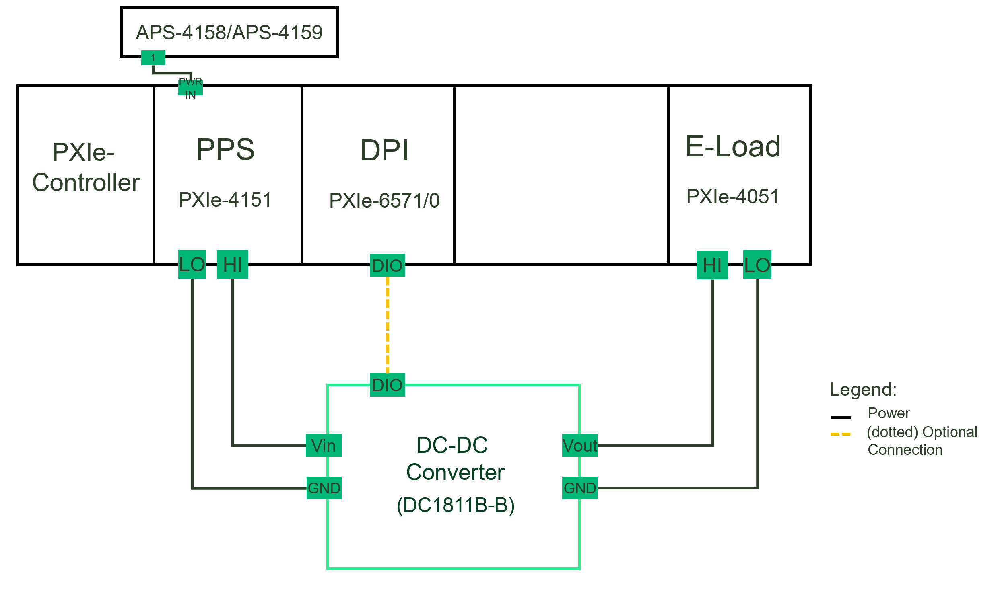
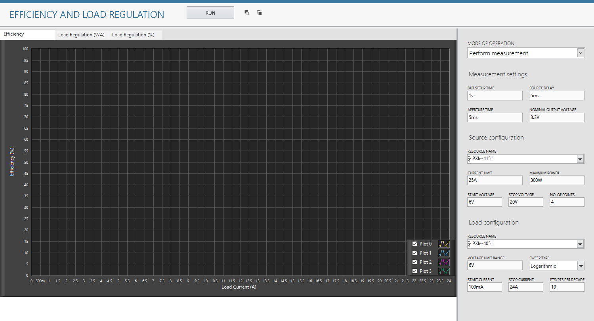
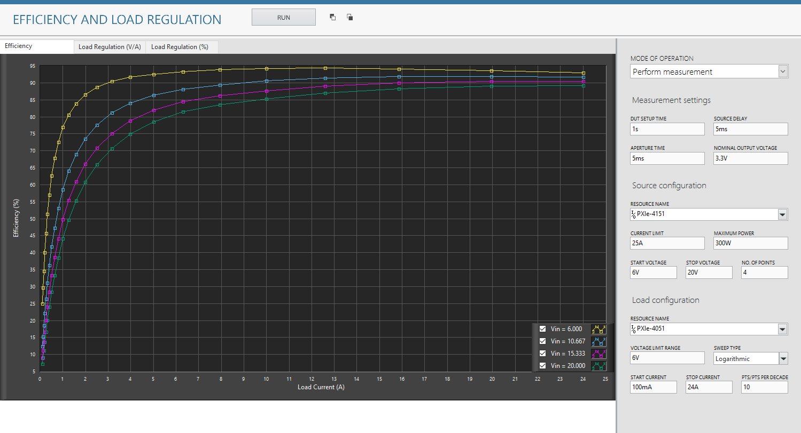
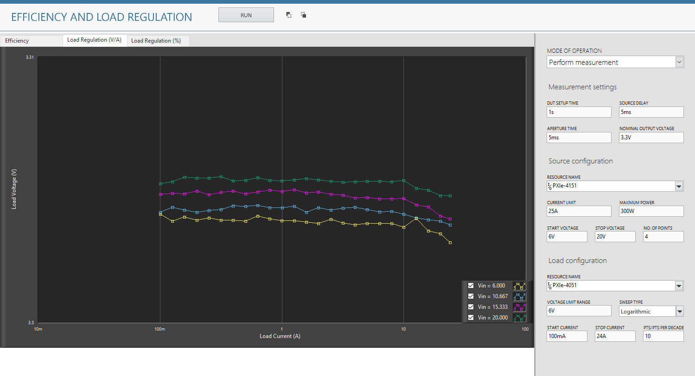
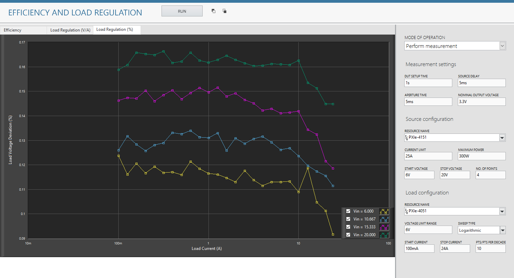

# Efficiency And Load Regulation
This service performs Efficiency and Load Regulation measurements.

## Hardware Setup
   

## InstrumentStudio Panel

### Usage

1. Select the appropriate source and load resource names and update other parameters as needed. Please note that, the measurement is in 'Perform Measurement' mode of operation by default.

   

2. Run the measurement. The efficiency, load voltage deviation values are calculated and plotted in the graphs.
   
   Efficiency:
   

   Load Regulation(V/A):
   

   Load Regulation(%):
   

