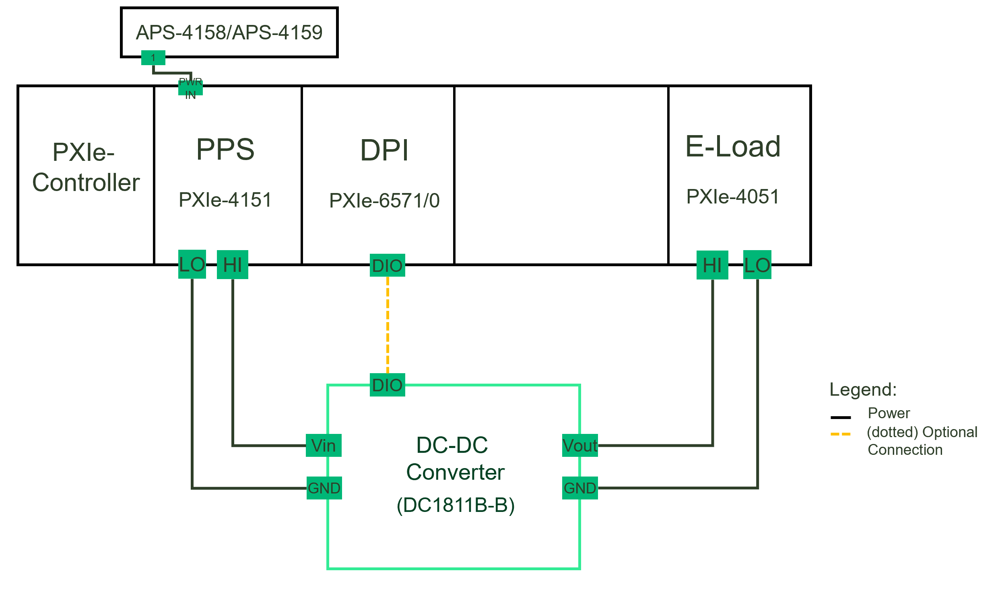

# Line Regulation
This service performs Line Regulation measurement.

## Hardware Setup
   

## InstrumentStudio Panel

### Usage

1. Select the appropriate source and load resource names and update other parameters as needed. Please note that, the measurement is in 'Perform Measurement' mode of operation by default.

   

2. Run the measurement. Line regulation graphs should be visible without any error.

   Line Regulation(V/V):
   

   Line Regulation(%):
   

