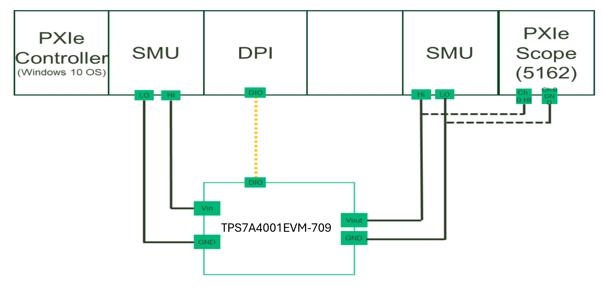

# Line Transient
This service performs Line Transient measurement.

## Hardware Setup
   

## InstrumentStudio Panel

### Usage

1. Select the appropriate source and load resource names and update other parameters as needed.

   
   
   Note:Disable scope if don't want to use

3. Run the measurement. Line transient graphs should be visible without any error.

   Line Transient:
   
