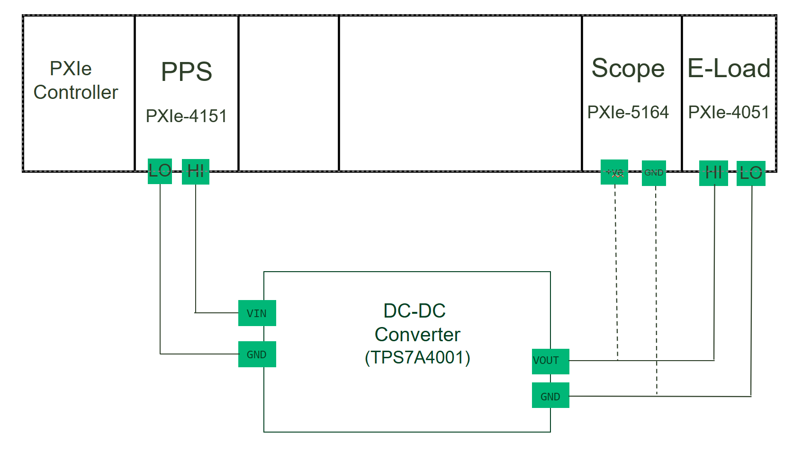
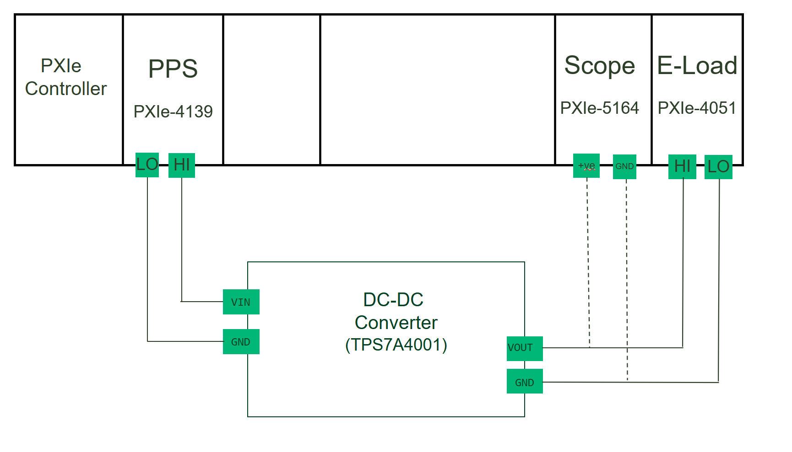

# Line Transient
This service performs Line Transient measurement. This mesurement supports 4151 and 4139 as power supply.

## Hardware Setup
   PXIe-4151 and PXIe-4051
   
   PXIe-4139 and PXIe-4051
   

## InstrumentStudio Panel

### Usage

1. Select the appropriate source and load resource names and update other parameters as needed.

   
   
   Note:Disable scope if don't want to use

3. Run the measurement. Line transient graphs should be visible without any error.

   Line Transient 4151 and 4051 :
   
   
   
   Line Transient 4139 and 4051 :
   
   
