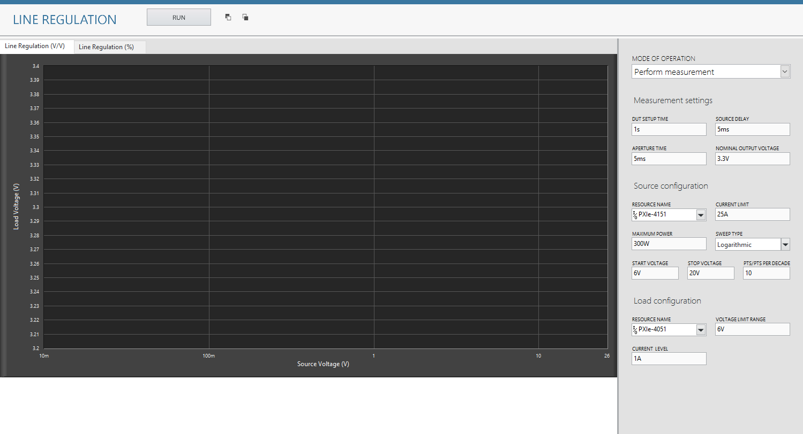

# Line Regulation
This service performs Line Transient measurement.

## Hardware Setup
   

## InstrumentStudio Panel

### Usage

1. Select the appropriate source and load resource names and update other parameters as needed.

   

2. Run the measurement. Line transient graphs should be visible without any error.

   Line Transient:
   
