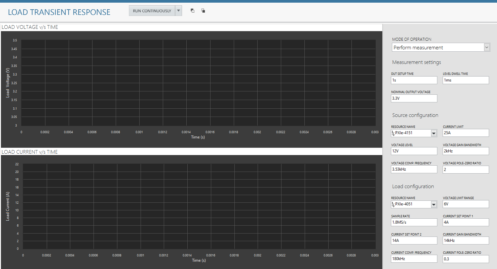
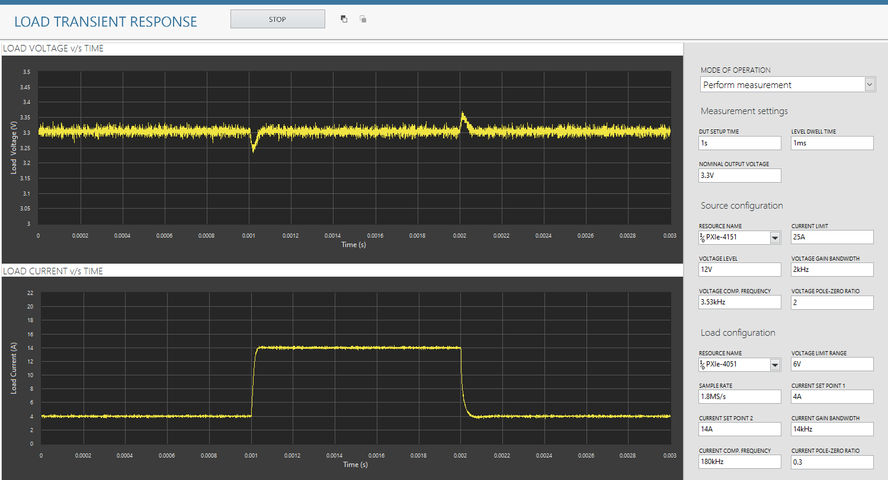

# Load Transient Response
This service performs Load Transient Response measurement.

## InstrumentStudio Panel

### Usage

1. Select the appropriate source and load resource names and update other parameters as needed. Please note that, the measurement is in 'Perform Measurement' mode of operation by default.

   

2. Run the measurement continuously. Follow the instructions [here](common/IS-continuous-run.md) on how to enable this feature. The corresponding load voltage and current graphs should be visible without any error.

   

3. Note that the measurement is in 'Custom' transient response by default. To change the transient response value, click on either Slow, Normal, or Fast. The SourceAdapt parameters will be updated accordingly. 
   Change any of the SourceAdapt parameters for custom transient response.
  
   

4. Make sure to select the 'Run' button instead of 'Run continuously' when any other mode of operation (Power on/off the DUT) is selected.

   
