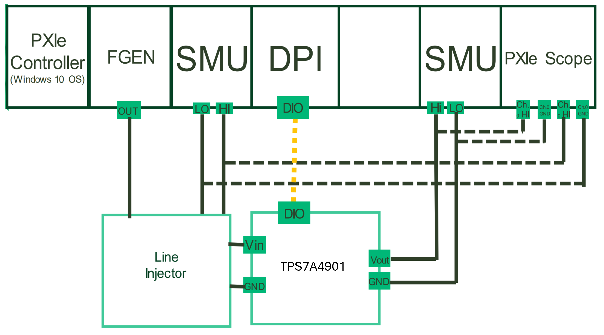
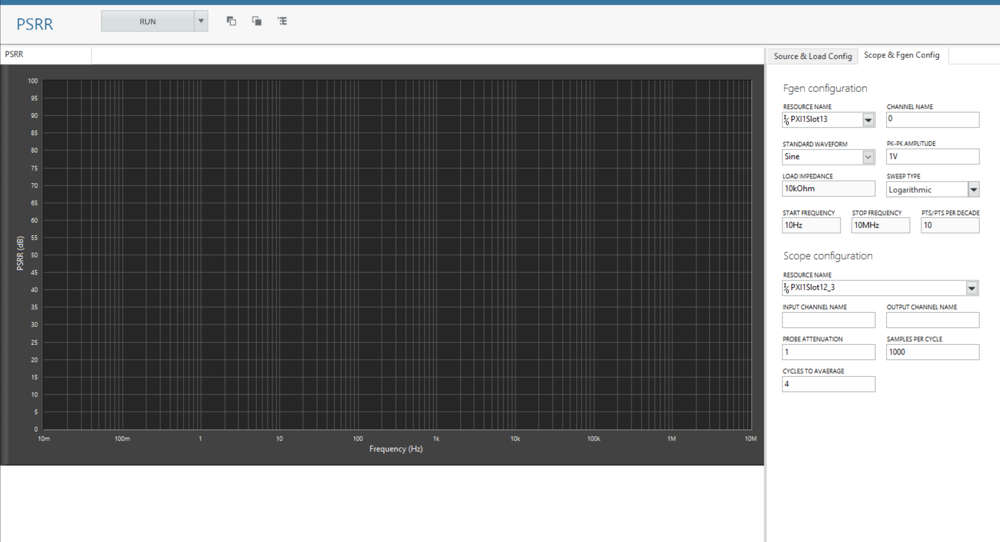

# PSRR
This service performs PSRR measurement.

## Hardware Setup
   

## InstrumentStudio Panel

### Usage

1. Select the appropriate source, load, fgen and scope resource names and update other parameters as needed. 

   
   

3. Run the measurement.
