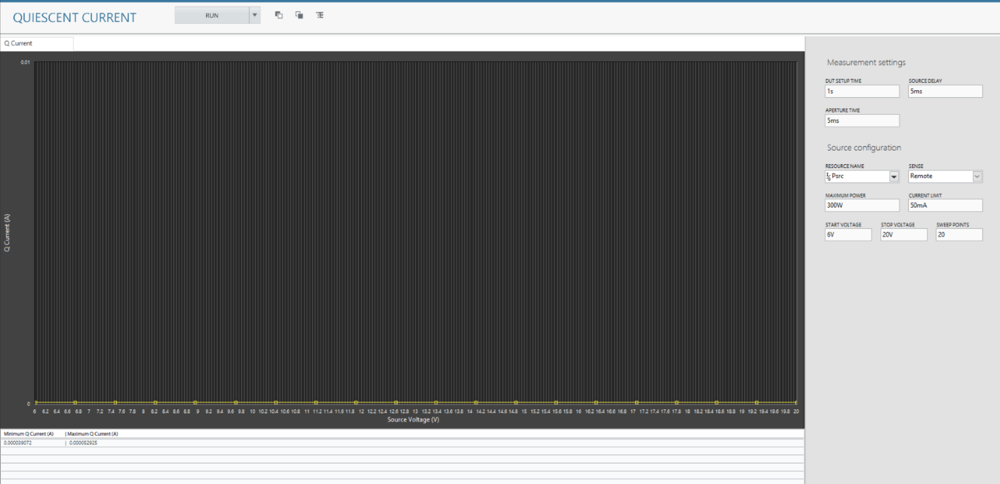

# quiescent current
This service performs quiescent current measurement.

## Hardware Setup
   

## InstrumentStudio Panel

### Usage

1. Select the appropriate source resource names. 

   

2. Run the measurement continuously. Follow the instructions [here](common/IS-continuous-run.md) on how to enable this feature. The corresponding source current graphs should be visible without any error.

   
