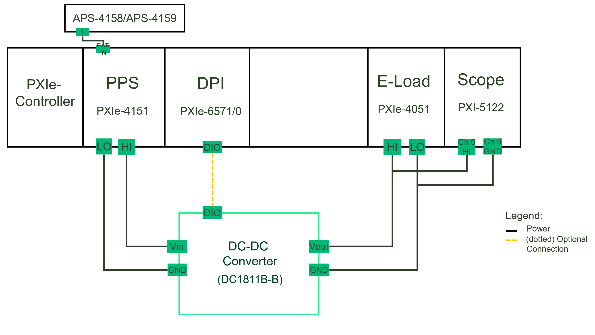

# Ripple Measurement
This service performs Ripple measurement.

## Hardware Setup

## InstrumentStudio Panel

### Usage

1. Select the appropriate source, load and scope resource names and update other parameters as needed. Please note that, the measurement is in 'Perform Measurement' mode of operation by default.

   

2. Run the measurement. The Ripple Voltage values are displayed on the graph. The RMS and Peak-to-Peak values of ripple are calculated and displayed in the table along with voltage and current values of source and load devices.
   
   

