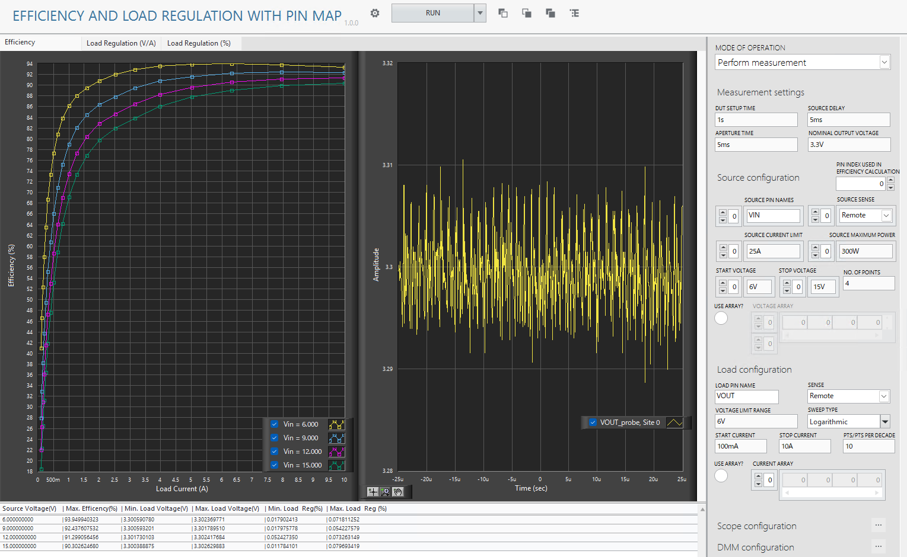
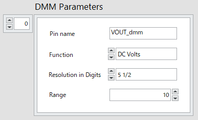

# Efficiency And Load Regulation with Pin Map

## Usage
1. Create and activate a pin map in your InstrumentStudio project according to [InstrumentStudio User Manual](https://www.ni.com/docs/ja-JP/bundle/instrumentstudio/page/pin-maps.html).

2. Select the appropriate source and load pin names and update other parameters as needed. Please note that the measurement is in 'Perform Measurement' mode of operation.   
    
Note: 
   - Multiple source pins can be set in SOURCE PIN NAMES array.  Sources are started in array index order. The source with index n starts, waits for the Source Delay, and then starts the source with index n+1. Load begins after all sources have completed. Source and load measurements begin after starting the load and waiting for the Source Delay.
   - If USE ARRAY? is set to True, the source voltage and load current can be specified in arrays, VOLTAGE ARRAY and CURRENT ARRAY. 
   - The array size of the source pin names, source sense, source current limit, source maximum power, start voltage, stop voltage, and the first dimension size of the voltage array (if USE ARRAY? is set to True) must be the same.
   - Efficiency is calculated using measurements of one of the sources and the load. Specify the source pin index used in the efficiency calculation in PIN INDEX USED IN EFFICIENCY CALCULATION.
   - (Optional) Oscilloscope measurements can be performed in synchronization with the source and load measurements. The reference triggers are activated after starting the load and waiting for the Source Delay. Click the "..." button next to Scope configuration to configure scopes. Please set the measurement to finish within the APERTURE TIME. Also, please be careful that Horizontal settings must be the same for pins connected to different channels of the same oscilloscope module. 
      
   - (Optional) DMM measurements can be performed in synchronization with the source and load measurements. They begin after starting the load and waiting for the Source Delay. Click the "..." button next to DMM configuration to configure DMMs. Please set the measurement to finish within the APERTURE TIME.
      

3. Run the measurement. The efficiency, load voltage deviation values are calculated and plotted in the graphs.