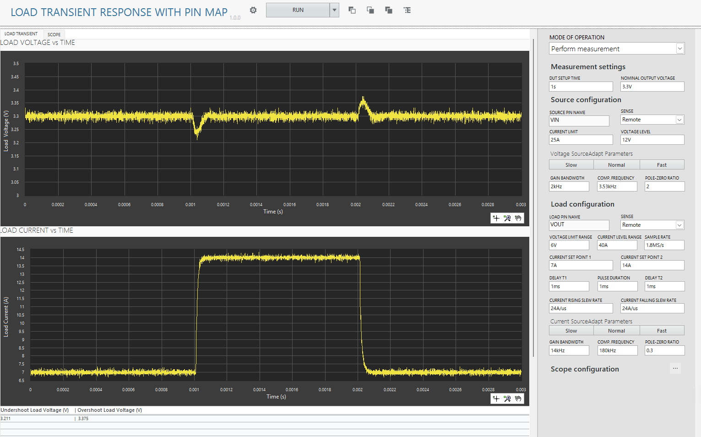

# Load Transient Response with Pin Map

## Usage
1. Create and activate a pin map in your InstrumentStudio project according to [InstrumentStudio User Manual](https://www.ni.com/docs/ja-JP/bundle/instrumentstudio/page/pin-maps.html).

2. Select the appropriate source and load pin names and update other parameters as needed. Please note that the measurement is in 'Perform Measurement' mode of operation. 
    
(Optional) Oscilloscope measurements can be performed in synchronization with the source and load measurements. The reference trigger is activated at **both the rising and falling edges of the load current**. Click the "..." button next to Scope configuration to configure scopes. Please set the measurement parameters so that the two measurement times triggered by the rising and falling edges do not overlap. Also, please be careful that Horizontal settings must be the same for pins connected to different channels of the same oscilloscope module.  
    

3. Run the measurement. 